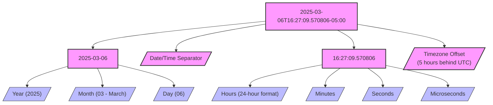

```mermaid
graph TD
A["2025-03-06T16:27:09.570806-05:00"]
A --> B["2025-03-06"]
A --> C["T"]
A --> D["16:27:09.570806"]
A --> E["-05:00"]

    B --> B1["2025"]
    B --> B2["03"]
    B --> B3["06"]
    B1[/"Year (2025)"/]
    B2[/"Month (03 - March)"/]
    B3[/"Day (06)"/]

    C[/"Date/Time Separator"/]

    D --> D1["16"]
    D --> D2["27"]
    D --> D3["09"]
    D --> D4[".570806"]
    D1[/"Hours (24-hour format)"/]
    D2[/"Minutes"/]
    D3[/"Seconds"/]
    D4[/"Microseconds"/]

    E[/"Timezone Offset
    (5 hours behind UTC)"/]

    classDef component fill:#f9f,stroke:#333,stroke-width:2px;
    classDef value fill:#bbf,stroke:#333,stroke-width:1px;

    class A,B,C,D,E component;
    class B1,B2,B3,D1,D2,D3,D4 value;
```
