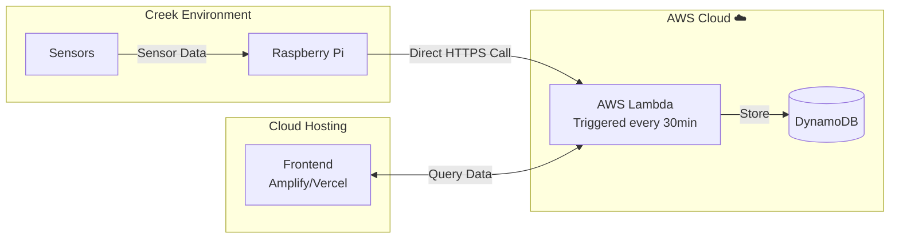

```mermaid
flowchart LR
    subgraph Field["Creek Environment"]
        S[Sensors]
        RPI[Raspberry Pi]
    end

    subgraph AWS["AWS Cloud ☁️"]
        direction TB
        Lambda["AWS Lambda
        Triggered every 30min"]
        DB[(DynamoDB)]
    end

    subgraph Hosting["Cloud Hosting"]
        Frontend["Frontend
        Amplify/Vercel"]
    end

    S -->|"Sensor Data"| RPI
    RPI -->|"Direct HTTPS Call"| Lambda
    Lambda -->|"Store"| DB
    Frontend <-->|"Query Data"| Lambda
```
