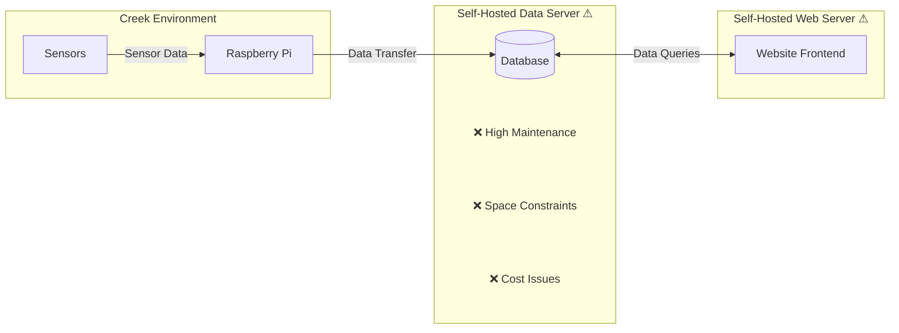

```mermaid

flowchart LR
    subgraph Field["Creek Environment"]
        S[Sensors]
        RPI[Raspberry Pi]
    end

    subgraph Backend["Self-Hosted Data Server ⚠"]
        DB[(Database)]
        note1["❌ High Maintenance"]
        note2["❌ Space Constraints"]
        note3["❌ Cost Issues"]
    end

    subgraph Frontend["Self-Hosted Web Server ⚠"]
        WEB[Website Frontend]
    end

    S -->|"Sensor Data"| RPI
    RPI -->|"Data Transfer"| DB
    DB <-->|"Data Queries"| WEB

    classDef note fill:none,stroke:none
    class note1,note2,note3 note

```
