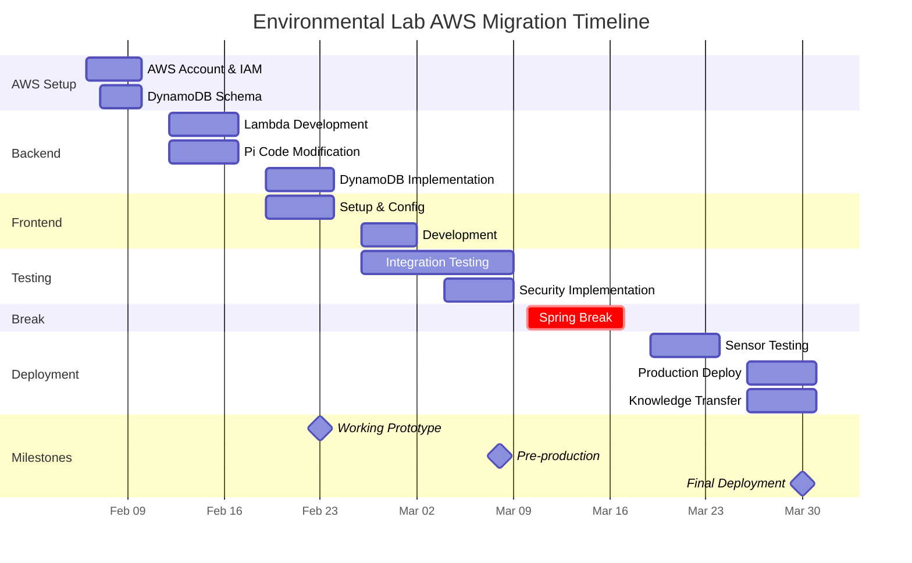

```mermaid
gantt
title Environmental Lab AWS Migration Timeline
dateFormat YYYY-MM-DD
axisFormat %b %d

    section AWS Setup
    AWS Account & IAM        :2025-02-06, 4d
    DynamoDB Schema         :2025-02-07, 3d

    section Backend
    Lambda Development      :2025-02-12, 5d
    Pi Code Modification    :2025-02-12, 5d
    DynamoDB Implementation :2025-02-19, 5d

    section Frontend
    Setup & Config          :2025-02-19, 5d
    Development            :2025-02-26, 4d

    section Testing
    Integration Testing     :2025-02-26, 11d
    Security Implementation :2025-03-04, 5d

    section Break
    Spring Break           :crit, 2025-03-10, 7d

    section Deployment
    Sensor Testing         :2025-03-19, 5d
    Production Deploy      :2025-03-26, 5d
    Knowledge Transfer     :2025-03-26, 5d

    section Milestones
    Working Prototype      :milestone, 2025-02-23, 0d
    Pre-production         :milestone, 2025-03-08, 0d
    Final Deployment       :milestone, 2025-03-30, 0d
```
